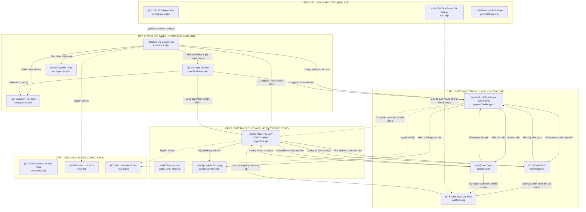

# 📘 BÁO CÁO PHÂN TÍCH TOÀN DIỆN 17 CHỨC NĂNG, THỦ TỤC & ĐIỀU KIỆN TIÊN QUYẾT
### HỆ THỐNG QUẢN LÝ NGUYÊN VẬT LIỆU HẠT NHỰA (PLASTIC MATERIAL MANAGEMENT SYSTEM)
> **Tài liệu kỹ thuật & Nghiệp vụ vận hành phân hệ Kiosk (Plastic Material Jig)**  
> *Ngày cập nhật: 07/10/2026 | Phiên bản: 2.0-Production*

---

## 📑 MỤC LỤC
1. [Tổng quan Kiến trúc & Nguyên lý Vận hành Poka-Yoke](#1-tổng-quan-kiến-trúc--nguyên-lý-vận-hành-poka-yoke)
2. [Sơ đồ Luồng Phụ thuộc 17 Chức năng (System Dependency Flowchart)](#2-sơ-đồ-luồng-phụ-thuộc-17-chức-năng)
3. [Phân tích Chi tiết 17 Chức năng & Thủ tục Stored Procedure](#3-phân-tích-chi-tiết-17-chức-năng--thủ-tục-stored-procedure)
   - [Chức năng (1): Nhập kho (inputStock.php)](#chức-năng-1-nhập-kho-inputstockphp)
   - [Chức năng (2): Xác nhận vị trí kệ (inputStockArea.php)](#chức-năng-2-xác-nhận-vị-trí-kệ-inputstockareaphp)
   - [Chức năng (3): Đổ Tank tại máy - OUT CHÍNH (outputTank.php)](#chức-năng-3-đổ-tank-tại-máy---out-chính-outputtankphp)
   - [Chức năng (4): Chuẩn bị Tank-Dryer (prepareTankDry.php)](#chức-năng-4-chuẩn-bị-tank-dryer-preparetankdryphp)
   - [Chức năng (5): Kết nối Tank-Dry-Máy (tankMch.php)](#chức-năng-5-kết-nối-tank-dry-máy-tankmchphp)
   - [Chức năng (6): Đổ Tank tại kho (outputTank_Kho.php)](#chức-năng-6-đổ-tank-tại-kho-outputtank_khophp)
   - [Chức năng (7): Vệ sinh Tank (clearTank.php)](#chức-năng-7-vệ-sinh-tank-cleartankphp)
   - [Chức năng (8): Vệ sinh Dryer (clearDry.php)](#chức-năng-8-vệ-sinh-dryer-cleardryphp)
   - [Chức năng (9): Cập nhật khối lượng Tank, Dryer (updateTankDry.php)](#chức-năng-9-cập-nhật-khối-lượng-tank-dryer-updatetankdryphp)
   - [Chức năng (10): Sửa thông tin input (editInputInfo.php)](#chức-năng-10-sửa-thông-tin-input-editinputinfophp)
   - [Chức năng (11): Cấu hình layout kho (configLayout.php)](#chức-năng-11-cấu-hình-layout-kho-configlayoutphp)
   - [Chức năng (12): Chuyển vị trí pallet (changeArea.php)](#chức-năng-12-chuyển-vị-trí-pallet-changeareaphp)
   - [Chức năng (13): Kiểm tra thông tin (checkInfo.php)](#chức-năng-13-kiểm-tra-thông-tin-checkinfophp)
   - [Chức năng (14): Gắn Tank-Dry-MCH Setup (test.php)](#chức-năng-14-gắn-tank-dry-mch-setup-testphp)
   - [Chức năng (15): Gắn nhựa Tank-Dryer (getTankDryer.php)](#chức-năng-15-gắn-nhựa-tank-dryer-gettankdryerphp)
   - [Chức năng (16): Lịch sử In (hisIn.php)](#chức-năng-16-lịch-sử-nhập-kho-hisinphp)
   - [Chức năng (17): Lịch sử Out (hisOut.php)](#chức-năng-17-lịch-sử-xuất-kho-hisoutphp)
4. [Bảng Ma trận Phụ thuộc Chéo (Cross-Dependency Matrix 17x17)](#4-bảng-ma-trận-phụ-thuộc-chéo)
5. [Các Kịch bản Vận hành Chuẩn tại Nhà xưởng (Standard SOP Scenarios)](#5-các-kịch-bản-vận-hành-chuẩn-tại-nhà-xưởng)

---

## 1. TỔNG QUAN KIẾN TRÚC & NGUYÊN LÝ VẬN HÀNH POKA-YOKE

Hệ thống quản lý nguyên vật liệu nhựa nhà máy được thiết kế trên mô hình **Máy trạng thái hữu hạn (Finite State Machine)** kết hợp triết lý **Poka-Yoke (Chống sai lỗi công nghiệp)** nhằm ngăn ngừa tuyệt đối rủi ro nghiêm trọng nhất trong sản xuất ép nhựa: **ĐỔ SAI LOẠI NHỰA HOẶC SAI MÀU VÀO MÁY ÉP**.

### Các thực thể cốt lõi và chu trình trạng thái:
1. **Kiện Pallet nguyên liệu (`Mate_Stock`):**
   - Trạng thái 1: *Đã nhập kho nhưng chưa có tọa độ kệ chính thức* (`Conf_Location` gợi ý hoặc `OVER`).
   - Trạng thái 2: *Đã cất lên kệ kho* (`ID_Location` đã quét xác nhận).
   - Trạng thái 3: *Đang xuất dở* (`Qty` giảm dần, lưu vết tại `Mate_His_Input_Tank`).
   - Trạng thái 4: *Đã xuất hết sạch* (`Qty = 0`).
2. **Bồn cấp liệu Tank (`Mate_Info_Tank`) & Bồn sấy Dryer (`Mate_Info_Dry`):**
   - Trạng thái: *Rỗng/Sạch* (`Grade = NULL, Qty = 0`) $\leftrightarrow$ *Đang chứa nhựa* (`Grade = '...', Color = '...', Qty > 0`).
   - Ràng buộc: Khi đang chứa nhựa loại A, hệ thống **CHẶN ĐỨNG** mọi lệnh đổ nhựa loại B vào bồn cho đến khi thực hiện thao tác Vệ sinh bồn (`Clear`).
3. **Máy ép Machine (`Mate_MC_Dry_Tank` & `Mate_Config_Manual_Mch_Part_Die`):**
   - Ràng buộc: Máy ép được gắn cứng với PartNo (mã linh kiện) và bộ khuôn. Mã linh kiện quy định chặt chẽ loại nhựa (`Grade`) và mã màu (`Color`). Khi quét máy ép tại bước Out, hệ thống sẽ đối chiếu chéo 3 bên: Nhựa trong Pallet $\equiv$ Nhựa trong Tank $\equiv$ Nhựa máy ép cần.

---

## 2. SƠ ĐỒ LUỒNG PHỤ THUỘC 17 CHỨC NĂNG

---

## 3. PHÂN TÍCH CHI TIẾT 17 CHỨC NĂNG & THỦ TỤC STORED PROCEDURE

---

### Chức năng (1): Nhập kho (`inputStock.php`)
- **Tập tin giao diện:** `plastic_material_jig/inputStock.php` $\rightarrow$ `view/formInput.php`
- **Tập tin xử lý AJAX:** `view/upFormInput.php`, `view/upFormInputAcceptArea.php`
- **Thủ tục Stored Procedure & Câu lệnh SQL:**
  - `EXEC [Material].[dbo].[Mate_Input_Stock] @Grade, @idCode, @colorCode, @lotNo, @weight, @maNhua, @Dim, @author`
  - `EXEC [Material].[dbo].[Mate_Up_Area_Stock] @area, @idCode, @kmCode`
  - `UPDATE [Material].[dbo].[Mate_Stock] SET ID_Location = @areaNeedAccept WHERE ID = @idCode`
- **Bảng CSDL tác động:**
  - `[Mate_Stock]`: INSERT kiện Pallet mới (lưu ID, Grade, Color_Code, Lot_No, Qty, Dim, Km_Code, Conf_Location, Date).
  - `[Mate_Store_In_New]`: INSERT bản ghi lịch sử nhập hàng chi tiết.
  - `[Mate_Current_Fifo]`: UPDATE chỉ số thứ tự FIFO tăng dần (`Fifoo = Fifoo + 1`).
  - `[Error_Material_Sys]`: INSERT bản ghi lỗi Poka-Yoke nếu công nhân quét sai kệ chỉ định.
- **Dữ liệu đầu vào bắt buộc:**
  - Mã thẻ nhân viên (`Author`), Barcode Tên nhựa (`Grade`), Barcode Mã màu (`Color`), Số Lot (`Lot No`), Khối lượng (`Weight` $\le 1000$ Kg), Mã tem Pallet mới (`idCode`).
- **Điều kiện tiên quyết (Prerequisites):**
  - Danh mục nhân viên đã có trong `[Mate_User]`.
  - Cặp `(Grade, Color)` đã được đăng ký trong danh mục kỹ thuật `[Mate_Master_Inform]` (để tự động điền `KM-Code` và `Dim`).
  - *(Khuyến nghị)* Đã cấu hình vị trí kệ qua chức năng **(11)**. Nếu chưa cấu hình hoặc kệ đầy, hệ thống sẽ tự động gán vị trí tràn `OVER`.
- **Là điều kiện tiên quyết cho:**
  - Chức năng **(2)** Xác nhận vị trí.
  - Chức năng **(3)** Xuất kho nạp máy.
  - Chức năng **(4)** Chuẩn bị sấy.
  - Chức năng **(10)** Sửa thông tin Pallet.
  - Chức năng **(12)** Điều chuyển Pallet.

---

### Chức năng (2): Xác nhận vị trí kệ (`inputStockArea.php`)
- **Tập tin giao diện:** `plastic_material_jig/inputStockArea.php` $\rightarrow$ `view/formInputStockArea.php`
- **Tập tin xử lý AJAX:** `view/upInputStockArea.php`
- **Thủ tục Stored Procedure & Câu lệnh SQL:**
  - `EXEC [Material].[dbo].[Mate_GetIdEmptyArea]` (Lấy danh sách các Pallet đang chờ xếp kệ có `ID_Location IS NULL` hoặc `OVER`).
  - `EXEC [Material].[dbo].[Mate_Up_Area_Stock] @area, @idCode, @kmCode`
- **Bảng CSDL tác động:**
  - `[Mate_Stock]`: UPDATE tọa độ vị trí kệ thực tế `ID_Location = @area`.
- **Điều kiện tiên quyết (Prerequisites):**
  - 🔴 **BẮT BUỘC:** Phải qua chức năng **(1) Nhập kho** trước. Kiện Pallet phải đã tồn tại trong `Mate_Stock`. Nếu không, danh sách chờ xếp kệ sẽ rỗng.
- **Là điều kiện tiên quyết cho:**
  - Chức năng **(12)** Chuyển vị trí Pallet (phải có vị trí ban đầu mới chuyển đi nơi khác được).
  - Giúp thủ kho và xe nâng định vị chính xác Pallet trên bản đồ trực quan khi cần kéo hàng đi xuất ở chức năng **(3)**.

---

### Chức năng (3): Đổ Tank tại máy - OUT CHÍNH (`outputTank.php`)
- **Tập tin giao diện:** `plastic_material_jig/outputTank.php` $\rightarrow$ `view/formOutputTank.php`
- **Tập tin xử lý AJAX:** `view/upFormOutputTank.php`, `view/checkIdPallet.php`, `view/checkTankInfo.php`, `view/checkDryInfo.php`, `view/checkMchOut.php`
- **Thủ tục Stored Procedure & Câu lệnh SQL:**
  - `EXEC [Material].[dbo].[Mate_CheckIdPallet] @ID, @typeTank, @checkInfo` (Kiểm tra tồn tại, số lượng còn lại, thứ tự FIFO).
  - `EXEC [Material].[dbo].[Mate_CheckTankInfo] @Tank, ''` (Kiểm tra loại bồn, nhựa đang chứa).
  - `EXEC [Material].[dbo].[Mate_CheckDryInfo] @Dry` (Kiểm tra máy sấy kết nối).
  - `EXEC [Material].[dbo].[Mate_CheckMchOut] @ID, @Machine, 'TankDryMch'` (Kiểm tra khuôn, PartNo của máy ép).
  - `EXEC [Material].[dbo].[Mate_OutputTank] @Tank, @Dry, @Mch, @total, @ID, @GradeBag, @ColorBag, @author, 'nguyen'`
- **Bảng CSDL tác động:**
  - `[Mate_Stock]`: UPDATE trừ tồn kho Pallet (`Qty = Qty - @total`).
  - `[Mate_Info_Tank]`: UPDATE nạp nhựa vào bồn máy (`ID = @ID, Qty = @total`).
  - `[Mate_MC_Dry_Tank]`: UPDATE liên kết thiết bị (`ID_Dry = @Dry, ID_Tank = @Tank WHERE ID_Machine = @Mch`).
  - `[Mate_His_Input_Tank]`: INSERT lịch sử xuất cấp liệu máy ép.
  - `[Error_Material_Sys]`: INSERT log vi phạm nếu xảy ra lỗi lẫn nhựa.
- **Điều kiện tiên quyết (Prerequisites) - HỘI TỤ 4 NHÁNH ĐIỀU KIỆN:**
  1. **Nhánh Pallet:** Đã qua **(1)** Nhập kho, Pallet còn tồn (`Qty > 0`), đúng nguyên tắc FIFO xuất hàng cũ trước.
  2. **Nhánh Thiết bị:** Cụm Tank ↔ Dryer ↔ Machine phải được cấu hình qua **(5)** hoặc **(14)**.
  3. **Nhánh Bồn chứa:** Bồn Tank và Dryer không được chứa nhựa khác loại. Nếu có nhựa cũ, **bắt buộc phải qua (7) và (8) để vệ sinh sạch** trước khi đổ.
  4. **Nhánh Sấy nóng (với nhựa kỹ thuật PA, PC, POM):** Hạt nhựa phải được nạp và sấy qua chức năng **(4)** trước.
- **Là điều kiện tiên quyết cho:**
  - Chức năng **(7), (8)** Vệ sinh bồn sau khi chạy xong đơn hàng.
  - Chức năng **(9)** Cập nhật khối lượng tồn dư trong bồn.
  - Chức năng **(17)** Xem lịch sử xuất kho.

---

### Chức năng (4): Chuẩn bị Tank-Dryer (`prepareTankDry.php`)
- **Tập tin giao diện:** `plastic_material_jig/prepareTankDry.php` $\rightarrow$ `view/formPrepareTankDry.php`
- **Tập tin xử lý AJAX:** `view/upFormPrepareTankDry.php`, `view/upFormPrepareTankDry1.php`
- **Thủ tục Stored Procedure & Câu lệnh SQL:**
  - `EXEC [Material].[dbo].[Mate_Prepare_Tank_Dry] @Tank, @Dry, @ID, @qtyBag, @code`
  - `EXEC [Material].[dbo].[Mate_Prepare_Tank_Dry_1] @Tank, @Dry, @total, @ColorBag, @GradeBag, @code`
- **Bảng CSDL tác động:**
  - `[Mate_Stock]`: UPDATE trừ khối lượng Pallet xuất ra đưa vào sấy.
  - `[Mate_Info_Dry]`: UPDATE ghi nhận hạt nhựa và khối lượng đang sấy trong cối.
  - `[Mate_His_Prepare_Tank_Dry]`: INSERT lịch sử nạp nhựa vào máy sấy.
- **Điều kiện tiên quyết (Prerequisites):**
  - 🔴 Phải có Pallet hợp lệ từ **(1)** (`Qty > 0`).
  - 🔴 Máy sấy Dryer phải sạch. Nếu cối sấy đang dính nhựa cũ khác màu, **bắt buộc phải qua (8) Vệ sinh Dryer** trước.
- **Là điều kiện tiên quyết cho:**
  - Cung cấp nguồn hạt nhựa đã sấy khô đạt tiêu chuẩn nhiệt ẩm cho chức năng **(3)** Đổ máy ép.

---

### Chức năng (5): Kết nối Tank-Dry-Máy (`tankMch.php`)
- **Tập tin giao diện:** `plastic_material_jig/tankMch.php` $\rightarrow$ `view/formTankMch.php`
- **Tập tin xử lý AJAX:** `view/upFormTankMch.php`
- **Thủ tục Stored Procedure & Câu lệnh SQL:**
  - `EXEC [Material].[dbo].[Mate_CheckTankInfo] @Tank, ''`
  - `EXEC [Material].[dbo].[Mate_CheckDryInfo] @Dry`
  - `EXEC [Material].[dbo].[Mate_CheckMchOut] '', @Mch, 'TankDryMch'`
  - `EXEC [Material].[dbo].[Mate_FormTankDryMch] @Tank, @Dry, @Mch, @code`
- **Bảng CSDL tác động:**
  - `[Mate_MC_Dry_Tank]`: UPDATE liên kết `ID_Dry = @Dry, ID_Tank = @Tank WHERE ID_Machine = @Mch`.
  - `[Mate_His_Tank_Dry_Mch]`: INSERT nhật ký thay đổi cấu hình đường cấp liệu.
- **Điều kiện tiên quyết (Prerequisites):**
  - Quét mã thẻ nhân viên hợp lệ từ `[Mate_User]`.
  - 🔴 **Ràng buộc kiểm tra chéo 3 bên:** Nếu Tank hoặc Dryer đang chứa nhựa, hệ thống kiểm tra đối chiếu: Nhựa trong bồn $\equiv$ Nhựa máy ép cần. Nếu không khớp, hệ thống **CHẶN ĐỨNG** $\rightarrow$ Người dùng bắt buộc phải chạy **(7) Vệ sinh Tank** hoặc **(8) Vệ sinh Dryer** để dọn bồn trước, hoặc dùng **(14)** nếu bồn rỗng cơ khí.
- **Là điều kiện tiên quyết cho:**
  - Chức năng **(3)** Đổ Tank tại máy (cho phép mở van cấp liệu vào máy).

---

### Chức năng (6): Đổ Tank tại kho (`outputTank_Kho.php`)
- **Tập tin giao diện:** Điều hướng tới `hisOut.php` hoặc module xuất bồn tập trung tại kho.
- **Mục đích & Thủ tục:** Xuất hạt nhựa từ Pallet nạp vào các bồn chứa di động ngay tại kho trước khi xe kéo chở bồn ra xưởng.
- **Điều kiện tiên quyết:** Phụ thuộc vào Pallet có sẵn trong kho từ **(1)**.

---

### Chức năng (7): Vệ sinh Tank (`clearTank.php`)
- **Tập tin giao diện:** `plastic_material_jig/clearTank.php` $\rightarrow$ `view/formClearTank.php`
- **Tập tin xử lý AJAX:** `view/upClearTankDry.php`
- **Thủ tục Stored Procedure & Câu lệnh SQL:**
  - `EXEC [Material].[dbo].[Mate_CheckTankInfo] @Tank, 'clearTank'`
  - `EXEC [Material].[dbo].[Mate_Clear_Tank_Dry] @Tank, @typee, @code, @total, @TankDiff`
- **Bảng CSDL tác động:**
  - `[Mate_Info_Tank]`: UPDATE xóa trắng dữ liệu bồn (`Qty = 0, ID = NULL, Grade = NULL, Color_Code = NULL`).
  - `[Mate_Stock_Again]`: INSERT/UPDATE số lượng nhựa thu hồi vào bao tái sử dụng (nếu chọn chế độ xả ra bao).
  - `[Mate_His_Clear_Tank_Dry]`: INSERT nhật ký vệ sinh bồn.
- **Điều kiện tiên quyết (Prerequisites):**
  - Bồn Tank phải tồn tại trong danh mục `Mate_Info_Tank`.
  - Thường được gọi sau khi bồn đã được đổ nhựa từ **(3)** hoặc **(15)** và chạy hết đơn hàng.
- **Là điều kiện tiên quyết cho:**
  - **BƯỚC SỐNG CÒN:** Là điều kiện tiên quyết để chức năng **(3)** và **(5)** có thể nạp/liên kết loại nhựa mới mà không bị còi báo động lỗi lẫn nhựa.

---

### Chức năng (8): Vệ sinh Dryer (`clearDry.php`)
- **Tập tin giao diện:** `plastic_material_jig/clearDry.php` $\rightarrow$ `view/formClearDry.php`
- **Tập tin xử lý AJAX:** `view/upClearTankDry.php`
- **Thủ tục Stored Procedure & Câu lệnh SQL:**
  - `EXEC [Material].[dbo].[Mate_CheckDryInfo] @Dry`
  - `EXEC [Material].[dbo].[Mate_Clear_Tank_Dry] @Dry, @typee, @code, @total, @TankDiff`
- **Bảng CSDL tác động:**
  - `[Mate_Info_Dry]`: UPDATE xóa trắng dữ liệu cối sấy (`Qty = 0, ID = NULL, Grade = NULL`).
  - `[Mate_Info_Tank]`: UPDATE tăng số lượng nếu chọn chế độ xả chuyển sang bồn Tank khác (`@TankDiff`).
  - `[Mate_His_Clear_Tank_Dry]`: INSERT nhật ký vệ sinh máy sấy.
- **Điều kiện tiên quyết (Prerequisites):**
  - Máy sấy Dryer phải tồn tại trong `Mate_Info_Dry`.
- **Là điều kiện tiên quyết cho:**
  - Cho phép chức năng **(4)** Chuẩn bị sấy và **(3)** Đổ máy tiếp nhận mẻ nhựa kỹ thuật mới.

---

### Chức năng (9): Cập nhật khối lượng Tank, Dryer (`updateTankDry.php`)
- **Tập tin giao diện:** `plastic_material_jig/updateTankDry.php` $\rightarrow$ `view/formUpdateTankDry.php`
- **Tập tin xử lý AJAX:** `view/upFormUpdateTankDryer.php`
- **Thủ tục Stored Procedure & Câu lệnh SQL:**
  - `EXEC [Material].[dbo].[Mate_CheckTankInfo] @Tank, ''` / `EXEC [Material].[dbo].[Mate_CheckDryInfo] @Dry`
  - `EXEC [Material].[dbo].[Mate_From_Update_TankDryer] @tanks, @weight, @author, @typeee`
- **Bảng CSDL tác động:**
  - `[Mate_Info_Tank]` hoặc `[Mate_Info_Dry]`: UPDATE ghi đè cột `Qty = @weight`.
  - `[Mate_His_Update_Tank_Dry]`: INSERT nhật ký hiệu chỉnh cân nặng kèm mã nhân viên.
- **Điều kiện tiên quyết (Prerequisites):**
  - Thiết bị Tank/Dryer phải tồn tại trong hệ thống.
  - Sử dụng sau khi đã nạp nhựa từ **(3), (4), (15)** mà có chênh lệch giữa số đếm lý thuyết và số cân sàn thực tế.

---

### Chức năng (10): Sửa thông tin input (`editInputInfo.php`)
- **Tập tin giao diện:** `plastic_material_jig/editInputInfo.php` $\rightarrow$ `view/formEditInputInfo.php`
- **Tập tin xử lý AJAX:** `view/upFormEditInputInfo.php`
- **Thủ tục Stored Procedure & Câu lệnh SQL:**
  - `EXEC [Material].[dbo].[Mate_CheckIdPallet] @ID, '', ''`
  - `EXEC [Material].[dbo].[Mate_From_Edit_Input_Info] @grade, @idCode, @colorCode, @lotNo, @weight, @weightRemain, @author, @kmCode1`
- **Bảng CSDL tác động:**
  - `[Mate_Stock]`: UPDATE sửa đổi Grade, Color_Code, Lot_No, Qty, Qty_Remain, Km_Code.
  - `[Mate_His_Edit_Input_Info]`: INSERT lịch sử chỉnh sửa phiếu nhập.
- **Điều kiện tiên quyết (Prerequisites):**
  - 🔴 **BẮT BUỘC:** Mã `ID Pallet` phải đã được tạo từ **(1) Nhập kho**. Nếu quét mã không tồn tại, hệ thống báo *"Không tồn tại ID: ..."*.
- **Là điều kiện tiên quyết cho:**
  - Đảm bảo dữ liệu Pallet đúng chuẩn trước khi xe nâng kéo ra xuất tại chức năng **(3)** hoặc **(4)**.

---

### Chức năng (11): Cấu hình layout kho (`configLayout.php`)
- **Tập tin giao diện:** `plastic_material_jig/configLayout.php` $\rightarrow$ `view/viewConfigLayout.php`
- **Tập tin xử lý AJAX:** `view/addLayout.php`, `view/upDelConfigLayout.php`
- **Thủ tục Stored Procedure & Câu lệnh SQL:**
  - `EXEC [Material].[dbo].[Mate_Get_Layout_Stock]`
  - `EXEC [Material].[dbo].[Mate_Config_Layout] @Grade, @Color, @Loca`
  - `EXEC [Material].[dbo].[Mate_Up_Del_Config_Layout] @id`
- **Bảng CSDL tác động:**
  - `[Mate_Layout_Material]`: INSERT/DELETE quy tắc gán cặp `(Grade, Color)` vào vị trí ô kệ `Loca`.
- **Điều kiện tiên quyết (Prerequisites):**
  - 🟢 **HOÀN TOÀN ĐỘC LẬP (Master Configuration):** Chạy trước khi xưởng tiếp nhận lô hàng hoặc khi quy hoạch lại mặt bằng nhà kho.
- **Là điều kiện tiên quyết cho:**
  - **TIÊN QUYẾT CHO (1) Nhập kho:** Thuật toán tự động tìm kệ trống trong `Mate_Input_Stock` dựa trên bảng cấu hình này để chỉ định kệ cho Pallet mới.

---

### Chức năng (12): Chuyển vị trí pallet (`changeArea.php`)
- **Tập tin giao diện:** `plastic_material_jig/changeArea.php` $\rightarrow$ `view/viewChangeArea.php`
- **Tập tin xử lý AJAX:** `view/upChangeArea.php`
- **Thủ tục Stored Procedure & Câu lệnh SQL:**
  - `EXEC [Material].[dbo].[Mate_CheckIdPallet] @ID, '', ''`
  - `EXEC [Material].[dbo].[Mate_Up_Change_Area] @area, @idPallet`
- **Bảng CSDL tác động:**
  - `[Mate_Stock]`: UPDATE `ID_Location = @area`.
  - `[Mate_His_Change_Area]`: INSERT lịch sử điều chuyển vị trí kệ.
- **Điều kiện tiên quyết (Prerequisites):**
  - 🔴 **BẮT BUỘC:** Pallet phải được tạo từ **(1)** và đang tồn kho (`Qty > 0`). Kệ đích phải hợp lệ trong `Mate_Location`.
- **Là điều kiện tiên quyết cho:**
  - Giữ bản đồ kho thời gian thực luôn khớp với thực địa, giúp tài xế tìm đúng Pallet khi xuất hàng.

---

### Chức năng (13): Kiểm tra thông tin (`checkInfo.php`)
- **Tập tin giao diện:** `plastic_material_jig/checkInfo.php` $\rightarrow$ `view/viewCheckInfo.php`
- **Thủ tục Stored Procedure:**
  - Gọi các SP tra cứu: `Mate_CheckIdPallet`, `Mate_CheckTankInfo`, `Mate_CheckDryInfo`, `Mate_CheckMchOut`, `Mate_Load_Location`, `summary_general_infomation_web`.
- **Bảng CSDL tác động:** Chỉ đọc (SELECT / No Write).
- **Điều kiện tiên quyết (Prerequisites):**
  - 🟢 **ĐỘC LẬP:** Cổng tra cứu tổng hợp. Muốn tra cứu đối tượng nào (Pallet, Bồn, Máy, Khuôn, Kệ) thì đối tượng đó phải được tạo trước trong hệ thống.

---

### Chức năng (14): Gắn Tank-Dry-MCH Setup (`test.php`)
- **Tập tin giao diện:** `plastic_material_jig/test.php` $\rightarrow$ `view/formTankMchTest.php`
- **Tập tin xử lý AJAX:** `view/upFormTankMch.php`
- **Thủ tục Stored Procedure:**
  - `EXEC [Material].[dbo].[Mate_FormTankDryMch] @Tank, @Dry, @Mch, ''`
- **Bảng CSDL tác động:**
  - `[Mate_MC_Dry_Tank]`: UPDATE liên kết `ID_Dry = @Dry, ID_Tank = @Tank WHERE ID_Machine = @Mch`.
- **Điều kiện tiên quyết (Prerequisites):**
  - 🟢 **GÁN NHANH CƠ KHÍ:** Dành cho kỹ thuật viên setup line khi bồn rỗng. **Bỏ qua kiểm tra loại nhựa và không bắt buộc quét thẻ nhân viên**.
- **Là điều kiện tiên quyết cho:**
  - Cho phép chức năng **(3)** Đổ máy nhận diện được đường ống cấp liệu đến máy ép.

---

### Chức năng (15): Gắn nhựa Tank-Dryer (`getTankDryer.php`)
- **Tập tin giao diện:** `plastic_material_jig/getTankDryer.php` $\rightarrow$ `view/formTankDryer.php`
- **Tập tin xử lý AJAX:** `view/upFromTankDryer.php`
- **Thủ tục Stored Procedure:**
  - `EXEC [Material].[dbo].[Mate_From_TankDryer] @tanks1, @grade, @color, @qty, @typee`
- **Bảng CSDL tác động:**
  - `[Mate_Info_Tank]` hoặc `[Mate_Info_Dry]`: UPDATE trực tiếp `Grade = @grade, Color_Code = @color, Qty = @qty`.
- **Điều kiện tiên quyết (Prerequisites):**
  - 🟢 **KHỞI TẠO BỒN ĐỘC LẬP:** Dành cho nạp nhựa vụn, nhựa tái sinh hoặc khởi tạo ban đầu **không qua quét Pallet**.
- **Là điều kiện tiên quyết cho:**
  - Cung cấp dữ liệu tồn bồn cho chức năng **(3)** hoặc **(5)**.

---

### Chức năng (16): Lịch sử In (`hisIn.php`) & (17): Lịch sử Out (`hisOut.php`)
- **Tập tin giao diện:** `plastic_material_jig/hisIn.php`, `plastic_material_jig/hisOut.php`
- **Thủ tục Stored Procedure:**
  - In: `EXEC [Material].[dbo].[Mate_His_In] @sDate, @eDate`
  - Out: `EXEC [Material].[dbo].[Mate_His_Out] @sDate, @eDate, @idPalletFil`
- **Bảng CSDL tác động:** Chỉ đọc từ `Mate_Store_In_New` và `Mate_His_Input_Tank`.
- **Điều kiện tiên quyết:** Phụ thuộc vào việc đã có giao dịch nhập kho từ **(1)** hoặc giao dịch xuất kho từ **(3), (4)**.

---

## 4. BẢNG MA TRẬN PHỤ THUỘC CHÉO (CROSS-DEPENDENCY MATRIX)

Ký hiệu:
- 🔴 **R (Required - Bắt buộc):** Chức năng dòng BẮT BUỘC phải thực hiện chức năng cột trước đó.
- 🟡 **O (Optional / Operational):** Phụ thuộc theo nghiệp vụ (tùy tình huống như bồn bẩn, nhựa sấy, vị trí kệ).
- ⚪ **- (None):** Không phụ thuộc.

| Chức năng thực hiện | (1) In | (2) Area | (3) Out | (4) Prep | (5) Link | (7) ClrTk | (8) ClrDry | (9) UpWt | (10) Edit | (11) Lay | (12) Chg | (14) Setup | (15) SetPl |
| :--- | :---: | :---: | :---: | :---: | :---: | :---: | :---: | :---: | :---: | :---: | :---: | :---: | :---: |
| **(1) Nhập kho** | - | - | - | - | - | - | - | - | - | 🟡 O | - | - | - |
| **(2) Xác nhận vị trí** | 🔴 **R** | - | - | - | - | - | - | - | - | - | - | - | - |
| **(3) Đổ Tank tại máy** | 🔴 **R** | 🟡 O | - | 🟡 O | 🔴 **R** | 🟡 O | 🟡 O | - | - | - | - | 🟡 O | - |
| **(4) Chuẩn bị sấy** | 🔴 **R** | 🟡 O | - | - | - | 🟡 O | 🟡 O | - | - | - | - | - | - |
| **(5) Kết nối Tank-Mch**| - | - | - | - | - | 🟡 O | 🟡 O | - | - | - | - | - | - |
| **(7) Vệ sinh Tank** | - | - | 🟡 O | - | - | - | - | - | - | - | - | - | 🟡 O |
| **(8) Vệ sinh Dryer** | - | - | 🟡 O | 🟡 O | - | - | - | - | - | - | - | - | 🟡 O |
| **(9) Cập nhật kg** | - | - | 🟡 O | 🟡 O | - | - | - | - | - | - | - | - | 🟡 O |
| **(10) Sửa phiếu nhập** | 🔴 **R** | - | - | - | - | - | - | - | - | - | - | - | - |
| **(11) Cấu hình layout**| - | - | - | - | - | - | - | - | - | - | - | - | - |
| **(12) Chuyển vị trí** | 🔴 **R** | 🟡 O | - | - | - | - | - | - | - | - | - | - | - |
| **(13) Kiểm tra tin** | 🟡 O | 🟡 O | 🟡 O | 🟡 O | 🟡 O | - | - | - | 🟡 O | 🟡 O | 🟡 O | 🟡 O | 🟡 O |
| **(14) Gắn Tank Setup** | - | - | - | - | - | - | - | - | - | - | - | - | - |
| **(15) Gắn nhựa bồn** | - | - | - | - | - | 🟡 O | 🟡 O | - | - | - | - | - | - |
| **(16) Lịch sử In** | 🔴 **R** | - | - | - | - | - | - | - | - | - | - | - | - |
| **(17) Lịch sử Out** | - | - | 🔴 **R** | 🟡 O | - | - | - | - | - | - | - | - | - |

---

## 5. CÁC KỊCH BẢN VẬN HÀNH CHUẨN TẠI NHÀ XƯỞNG (STANDARD SOP SCENARIOS)

### 🟢 KỊCH BẢN 1: QUY TRÌNH TIÊU CHUẨN ĐẦU - CUỐI (TỪ NHẬP ĐẾN ÉP)
Dành cho mã hàng sản xuất thông thường (nhựa không cần sấy nhiệt):
1. **Bước 1:** Thủ kho chạy **(11) Cấu hình layout** (nếu là loại nhựa mới chưa quy hoạch kệ).
2. **Bước 2:** Thủ kho thực hiện **(1) Nhập kho** khi xe container giao hàng $\rightarrow$ In tem Pallet ID.
3. **Bước 3:** Xe nâng kéo Pallet vào kho, chạy **(2) Xác nhận vị trí kệ** $\rightarrow$ Cất Pallet lên kệ chỉ định.
4. **Bước 4:** Kỹ thuật viên chạy **(5) Kết nối Tank-Dry-Máy** (hoặc **(14)**) để map đường ống cấp liệu vào máy ép.
5. **Bước 5:** Công nhân kéo Pallet đến máy ép, chạy **(3) Đổ Tank tại máy** $\rightarrow$ Bắn tem vỏ bao, nạp nhựa vào máy.
6. **Bước 6:** Kế toán/QA vào **(16) Lịch sử In** và **(17) Lịch sử Out** để đối soát dữ liệu.

---

### 🟡 KỊCH BẢN 2: CHUYỂN ĐỔI MÃ HÀNG / ĐỔI MÀU NHỰA (CHANGEOVER)
Dành cho máy ép vừa hoàn thành đơn hàng sản phẩm đen, chuyển sang ép sản phẩm trắng:
1. **Bước 1:** Công nhân chạy **(7) Vệ sinh Tank** $\rightarrow$ Xả sạch hạt nhựa đen còn sót trong bồn, cân thu hồi đóng bao dán tem `Mate_Stock_Again`.
2. **Bước 2:** Công nhân chạy **(8) Vệ sinh Dryer** $\rightarrow$ Xả sạch và vệ sinh buồng sấy nhiệt.
3. **Bước 3:** Kỹ thuật viên lên khuôn mới và chạy **(5) Kết nối Tank-Dry-Máy** $\rightarrow$ Hệ thống kiểm tra bồn đã sạch, cho phép gán khuôn mới.
4. **Bước 4:** Tiến hành xuất hạt nhựa trắng tại **(3) Đổ Tank tại máy** mà không bị hệ thống chặn còi báo động "Sai nhựa".

---

### 🔵 KỊCH BẢN 3: XỬ LÝ NHỰA KỸ THUẬT CẦN SẤY NHIỆT (PRE-DRYING)
Dành cho nhựa PA66, PC, POM cần sấy từ 2 – 4 tiếng:
1. **Bước 1:** Kiểm tra máy sấy sạch qua **(8)**.
2. **Bước 2:** Trước giờ máy ép chạy 3 tiếng, công nhân kéo Pallet từ kho chạy **(4) Chuẩn bị Tank-Dryer** $\rightarrow$ Rạch bao trút vào cối sấy.
3. **Bước 3:** Sau khi sấy đủ nhiệt độ và thời gian, kỹ thuật viên map đường cấp liệu qua **(5)**.
4. **Bước 4:** Bắt đầu ép và cấp tiếp liệu qua **(3) Đổ Tank tại máy**.

---

### 🟣 KỊCH BẢN 4: HIỆU CHỈNH SAI SỐ CÂN VÀ SỬA LỖI NHẬP LIỆU
1. **Khi quét sai tem lúc nhập kho:** Quản lý mở ngay **(10) Sửa thông tin input** để sửa lại Tên nhựa, Lot No hoặc số Kg trước khi Pallet bị đem đi xuất nhầm.
2. **Khi dời hàng giữa các kệ:** Xe nâng dời Pallet từ kho tràn `OVER` vào ô kệ chính, chạy **(12) Chuyển vị trí pallet** để cập nhật vị trí.
3. **Khi kết thúc ca kiểm kê bồn:** Quản lý cân thực tế bồn chứa, chạy **(9) Cập nhật khối lượng Tank, Dryer** để đồng bộ số cân thực tế với máy tính.

---
*Tài liệu được biên soạn và lưu trữ chính thức tại kho lưu trữ dự án: `doc/phan_tich_17_chuc_nang_va_dieu_kien_tien_quyet.md`.*
